# 00 - Prérequis
 
 - Serveur Ubuntu 20.04 
 - Une infrastructure réseau (Routeur, AD...)

## Infrastructure réseau

| Information           | Valeur            |
| --------------------- | ----------------- |
| IP du Firwall         | 172.20.130.1      |
| IP du serveur Windows | 172.20.130.10     |
| IP du serveur Zimbra  | 172.20.130.90<br> |
| Domaine de Messagerie | Artemis           |
| DNS Primaire          | 172.20.130.10     |

# 01 - Configuration Serveur Windows
## 1.1 Enregistrement DNS

Premièrement, il faut créer une entrée DNS pour l'IP du serveur.
Donc dans le menu gestionnaire de DNS : 
-  développer **Zone de Recherche directe**
-  Faire un **clique droit** sur Artemis.net
- Choisir **New Host (A or AAAA)...**

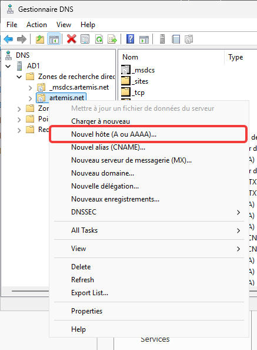

Il suffit ensuite, de remplir :
-  **Name** : mail
-  **IP Address** : 172.20.130.90 
-  Cocher **Create associated pointer (PTR) record**
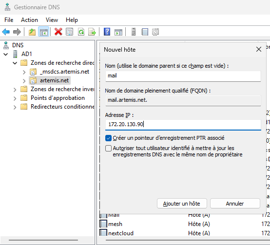


## 1.2 Enregistrement MX

Toujours dans la fenêtre **DNS Manager** :
-  Faire un **clique droit** sur Artemis.net
- Choisir **New Mail Exchanger (MX)...**
- Remplir puis validé
	-  **Host or child domain** : (laisser vide pour @)
	- **Mail server** : `mail.artemis.net`
	- **Mail server priority** : `10`

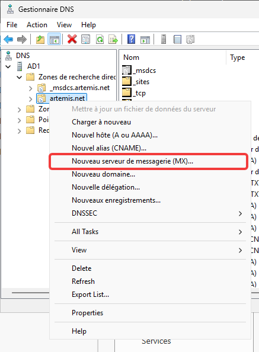
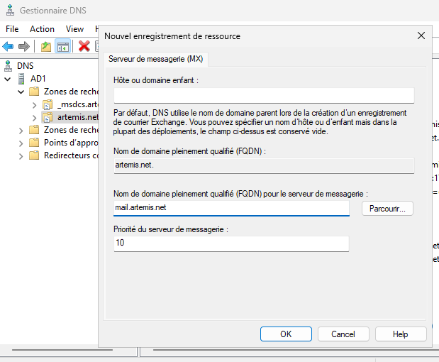

## 1.3 Vérification PTR

Dans la fenêtre **DNS Manager**, développer **Reverse Lookup Zones** et vérifier si la zone **130.20.172.in-addr.arpa** existe.


## 1.4 Enregistrements TXT (SPF, DMARC)

Pour faciliter l'enregistrement, nous utilisons PowerShell.
Dans une fenêtre PowerShell, executer les commande :
- Pour le SPF
```PowerShell
Add-DnsServerResourceRecord -ZoneName "artemis.net" -Name "@" -Txt -DescriptiveText "v=spf1 mx ip4:172.20.130.90 -all"
```

- Pour le DMARC
```PowerShell
Add-DnsServerResourceRecord -ZoneName "artemis.net" -Name "_dmarc" -Txt -DescriptiveText "v=DMARC1; p=quarantine; rua=mailto:postmaster@artemis.net"
```

- Pour Vérifier
```PowerShell
Get-DnsServerResourceRecord -ZoneName "artemis.net" -RRType TXT
```
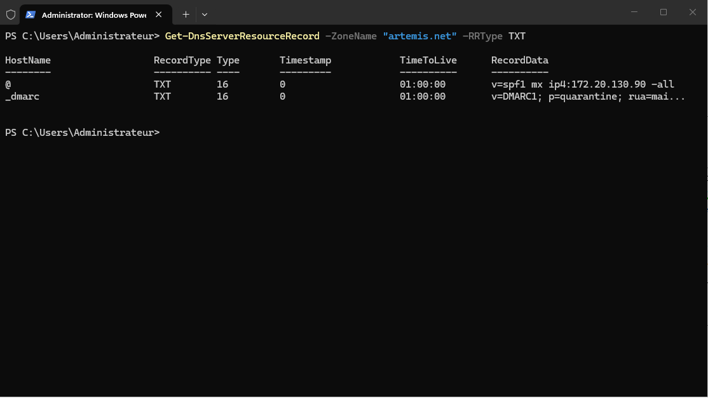

# 02 - Configuration Serveur Ubuntu
## 2.1 Configuration réseau

Configuration du fichier /etc/hosts.

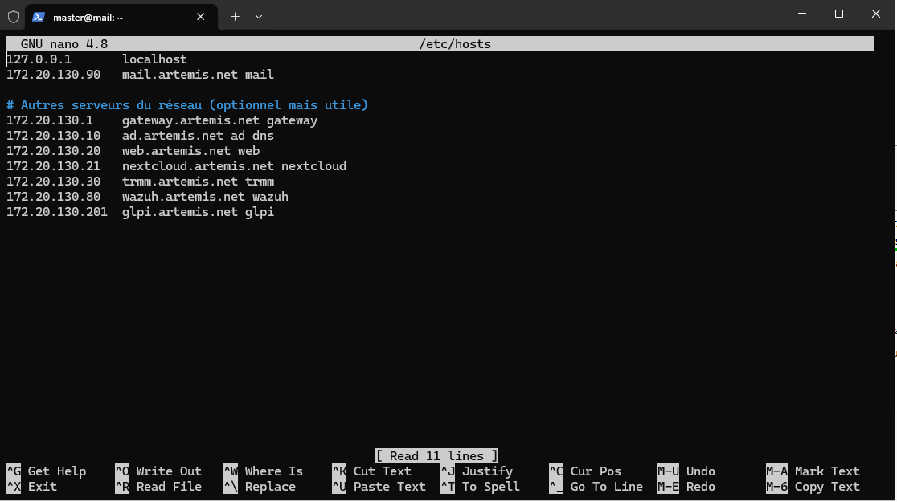
## 2.2 Configuration DNS

Configuration du fichier /etc/netplan/00-installer-config.yaml

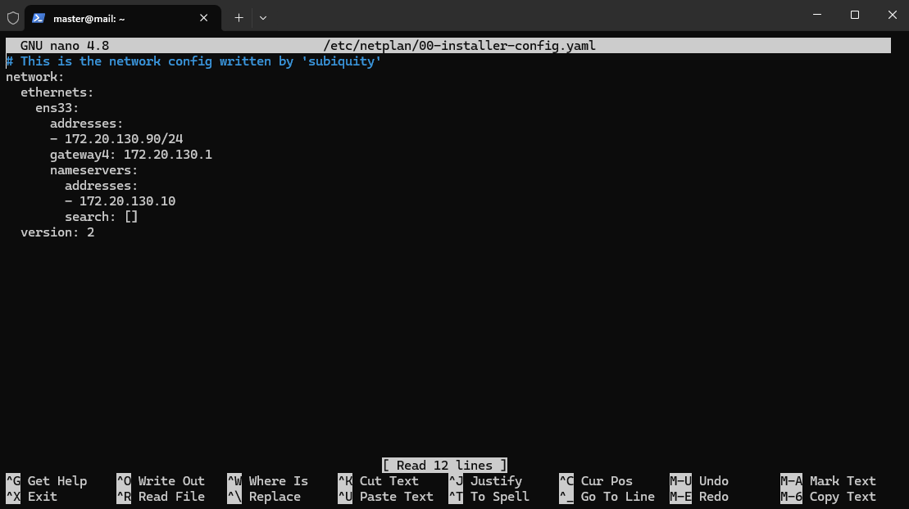

Puis application des changement avec : `netplan apply`

# 03 - Installation de Zimbra

Après mise à jour des dépôt et des paquets, installation des dépendance comme `wget` et `tar`.
Téléchargement de Zimbra
```bash
wget https://files.zimbra.com/downloads/8.8.15_GA/zcs-8.8.15_GA_4179.UBUNTU20_64.20211118033954.tgz
```

Puis extraction de l'archive 
```bash
 tar xzvf zcs-8.8.15_GA_4179.UBUNTU20_64.20211118033954.tgz
```

il faut ensuite exécuter le script `install.sh` et choisir les paquet qui vous intéresses et attendre la fin de l'installation des paquets.
Une fois terminer, le script nous incite a créer un mot de passe pour le compte admin de Zimbra puis lancer l'installation final.

# 04 - Configuration Zimbra

Il faut tout d'abor ce connecter sur l'interface d'administration à l'adresse https://172.20.130.90:7071 et rentrer l'identifiant et le mot de passe du compte `admin@artemis.net`, celui créer précédemment.

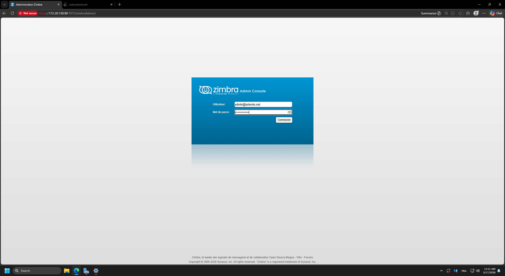

Pour tester l'envoi de mail, nous créons un compte de teste.

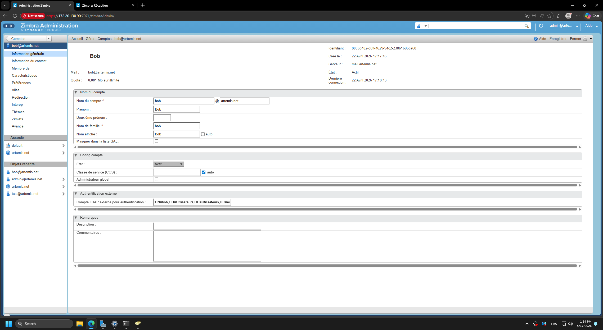

Nous pouvons tester la bonne réception des mail entre le compte admin et le compte de teste a partir de maintenant.

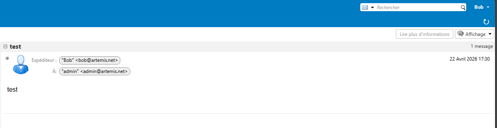
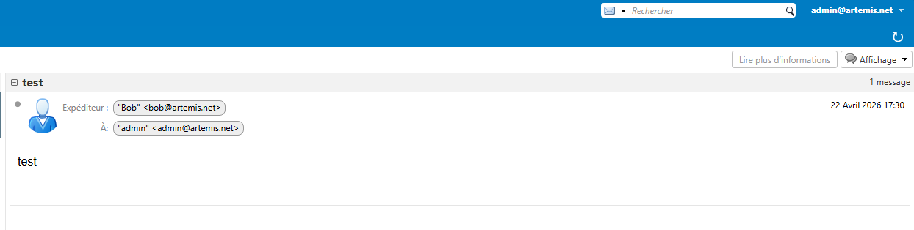
